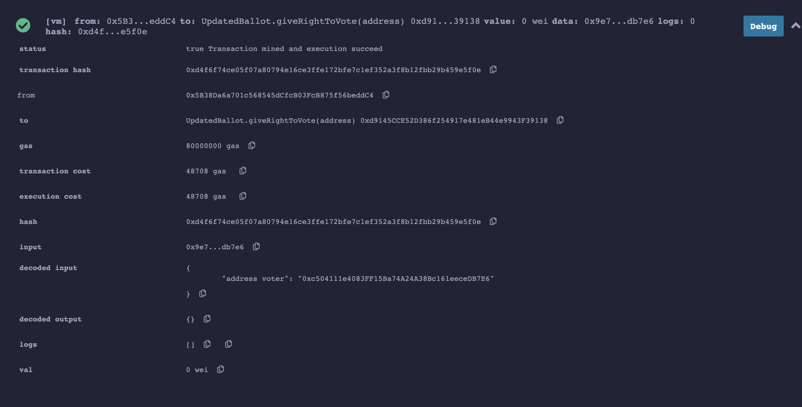

## zku.ONE Background Assignment

| Name                      | Value                       |
| ------------------------- | --------------------------- |
| course registration email | giordano3102lucas@gmail.com |
| discord username          | giordano-lucas#9939         |
|                           |                             |

# Hello World

## Code

```javascript
// SPDX-License-Identifier: GPL-3.0

pragma solidity >=0.7.0 <0.9.0;

/**
 * @title HelloWorld
 * @dev store an unsigned integer and then retrieve it
 */
contract HelloWorld {

    uint256 number;
    /**
     * @dev Store value in variable
     * @param num value to store
     */
    function store(uint256 num) public {
        number = num;
    }
    /**
     * @dev Return value
     * @return value of 'number'
     */
    function retrieve() public view returns (uint256){
        return number;
    }
}
```

## Screenshot of the Remix UI


# Improved Ballot : idea description

In the current Ballot implementation, to give the right to vote, we need to make 10 different call the `giveRightToVote` which introduces a large gas fee cost. To deal with this, we can pass an array of all the addresses we want to the give the right to vote to another function that I called `giveMutlipleRightsToVote`. In this function, we simply iterate over all voters and call the `__giveRightToVote` to make the code modular.

> **Note**: we had to define another internal function because the :

```javascript
require(msg.sender == chairperson, "Only chairperson can give right to vote.");
```

> would fail

# Improved Ballot : implementation

## Code (only relevant functions)

```javascript
 // Internal : Give `voter` the right to vote on this ballot.
    function __giveRightToVote(address voter) internal {
        // check that the voter has not voted yet
        require(
            !voters[voter].voted,
            "The voter already voted."
        );
        // cannot givte give a vote right to someone
        // who alright has the right
        require(voters[voter].weight == 0);
        voters[voter].weight = 1;
    }


    // Give `voter` the right to vote on this ballot.
    // May only be called by `chairperson`.
    function giveRightToVote(address voter) external {
        // If the first argument of `require` evaluates
        // to `false`, execution terminates and all
        // changes to the state and to Ether balances
        // are reverted.
        // This used to consume all gas in old EVM versions, but
        // not anymore.
        // It is often a good idea to use `require` to check if
        // functions are called correctly.
        // As a second argument, you can also provide an
        // explanation about what went wrong.
        require(
            msg.sender == chairperson,
            "Only chairperson can give right to vote."
        );
        __giveRightToVote(voter);
    }
    // Give all voters in `_voters` the right to vote on this ballot.
    // May only be called by `chairperson`.
    function giveMutlipleRightsToVote(address[] memory _voters) external
    {
        // If the first argument of `require` evaluates
        // to `false`, execution terminates and all
        // changes to the state and to Ether balances
        // are reverted.
        // This used to consume all gas in old EVM versions, but
        // not anymore.
        // It is often a good idea to use `require` to check if
        // functions are called correctly.
        // As a second argument, you can also provide an
        // explanation about what went wrong.
        require(
            msg.sender == chairperson,
            "Only chairperson can give right to vote."
        );
        // iterate over all _voters and call the giveRighToVote function
        // to give them the right to vote
        for (uint256 i = 0; i < _voters.length; i++) {
            __giveRightToVote(_voters[i]);
        }
    }
```

## screenshots (before and after) of the gas fees for the transaction(s) to give 10 voters the right to vote.

> **Contract Deployment using the parameter** : ["0x50726f706f73616c204100000000000000000000000000000000000000000000","0x50726f706f73616c204200000000000000000000000000000000000000000000", "0x50726f706f73616c204300000000000000000000000000000000000000000000"]

### Single `giveRightToVote`



We see that we paid : `48708 gas` for a single call which amounts to roughly `487080 gas` for 10 calls.

### Batch `giveRightToVote` using the `giveMutlipleRightsToVote` function

> **giveMutlipleRightsToVote argument**: ["0x96331B0c60b10d0B061FA0eC801ecF8B314B68d8", "0x69dC7e4A8Dd1a23A31009D41495F5EC26C56fB91", "0x03C98fa6d4c9399ebdC4428192727A6d35b1Ae06", "0x6a67Ca7Ef25b24e969D6631019FF64Ef35babd97", "0x08F8ffB7498c3fe5720ffEc01B06ca01564BfC0e", "0x8Fa1763ba22F90ecd1360E30f2AB47BE789D88f2", "0x2d9ac8F87d8d4027c627D019bd2105570dbA11Fc", "0x17e746669f35FFf4a46881FEBcd58A067725f526", "0x2343DFB59521bfC0Dd8209c3E54Bec27cbdb94D9", "0x4230B1F13F760Dc24dE9987AFE74c3acb1796d9C"]

In this case, we see that we paid : `279428 gas` which is 1.7x less than what we would pay if we use 10 separated transactions
